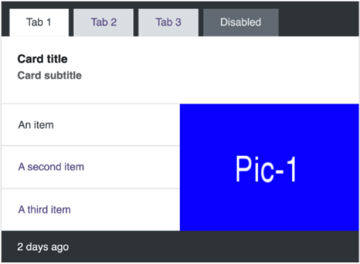

# Odoo Technical Test - UX/UI Designer

## Live Demo

🚀 You can view the deployed version
here: <a href="https://odoo-technical-test-rust.vercel.app/" target="_blank">odoo-technical-test-rust.vercel.app</a>

## Overview

This project represents a technical assessment for the UX/UI Designer position at Odoo. It demonstrates UI/UX design
capabilities, implementation skills, and understanding of Odoo's design principles.

## Tech Stack

- **Vite** - Next Generation Frontend Tooling
- **Bootstrap 5** - Frontend CSS Framework
- **SASS/SCSS** - CSS Preprocessor
- **JavaScript** - Programming Language

## Setup Instructions

1. Clone the repository
    ```bash
    git clone git@github.com:loanTranduy/odoo-technical-test.git
    cd odoo-technical-test
    ```
2. Install dependencies
    ```bash
    npm install
    ```
3. Start the development server
    ```bash
    npm run dev
    ```
   This will start the Vite development server with hot module replacement (HMR) at `http://localhost:3000`

## Project Structure

```
├── public/             # Static assets served as-is
├── src/
│   ├── custom.scss     # custom style
│   ├── main.js         # html
└── index.html          # Entry point
```

## Task

### Variant A : Replicate

| Base                         | Variant A                        |
|------------------------------|----------------------------------|
|  |  |

### Side-by-side differences:

### What Changed?

Card Header:

- Reduced top and right padding.

Tab buttons:

- Increased vertical padding.
- Slightly different shade of purple.

Tab 1: Card body:

- Reduced top and bottom padding around the title and subtitle.
- Adjusted image ratio.

Card Footer:

- smaller font size
- ...

### Why ?

- **Colors**: I selected the closest available color from Bootstrap's _variables.scss to avoid odd color values.
- **Image Ratio**: I wrapped the images in a container with an existing ratio (4x3) to ensure consistency, regardless of
  the
  image used.
- **Padding & Font Sizes**: I adhered to Bootstrap’s utility classes (e.g., .card-body) instead of modifying values that
  weren’t explicitly provided. Customization was applied only to clearly specified values like 600px, 20px, and 50%.

## Development Process & Considerations

My usual approach is to:

- Review design mockups thoroughly.
- Request necessary assets (SVGs, PNGs, animations, etc.).
- Check for edge cases (slow internet, optional elements?, responsiveness, accessibility, empty states,...).
- Implement a pixel-perfect, consistent component.

If I had received this task at **Odoo**, I would have reached out to the assigned designer for clarification on spacing,
behavior, and any missing details.

My focus here was **maximizing Bootstrap usage**.
