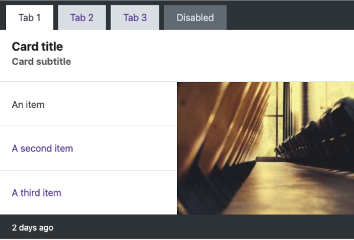
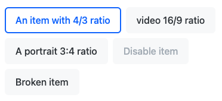
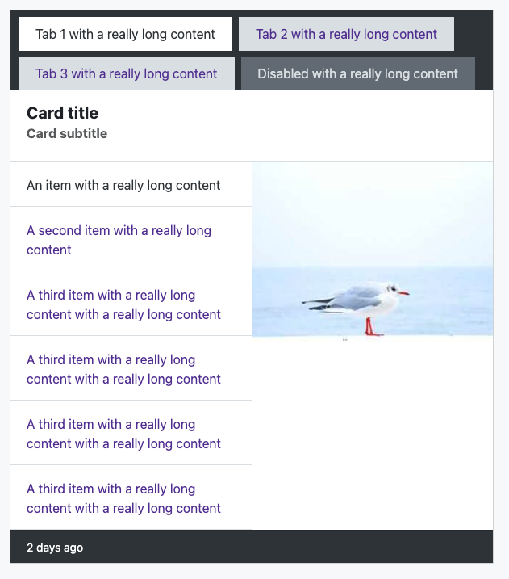

# Odoo Technical Test - UX/UI Designer

## Live Demo

🚀 You can view the deployed version
here: <a href="https://odoo-technical-test-rust.vercel.app/" target="_blank">odoo-technical-test-rust.vercel.app</a>

## Access

The different **variants** of the exercise are available either in separate **commits** or dedicated **branches**.

**Below** in this **README**, you will find **notes** on each exercise along with the **UX report**.

## Overview

This project represents a technical assessment for the UX/UI Designer position at Odoo. It demonstrates UI/UX design
capabilities, implementation skills, and understanding of Odoo's design principles.

## Tech Stack

- **Vite** - Next Generation Frontend Tooling
- **Bootstrap 5** - Frontend CSS Framework
- **SASS/SCSS** - CSS Preprocessor
- **JavaScript** - Programming Language

## Setup Instructions

1. Clone the repository
    ```bash
    git clone git@github.com:loanTranduy/odoo-technical-test.git
    cd odoo-technical-test
    ```
2. Install dependencies
    ```bash
    npm install
    ```
3. Start the development server
    ```bash
    npm run dev
    ```
   This will start the Vite development server with hot module replacement (HMR) at `http://localhost:3000`

## Project Structure

```
├── public/             # Static assets served as-is
├── src/
│   ├── custom.scss     # custom style
│   ├── main.js         # html
└── index.html          # Entry point
```

## Variant A : Replicate

| Base                         | Variant A                        |
|------------------------------|----------------------------------|
|  |  |

### Side-by-side differences:

Card Header:

- Reduced top and right padding.

Tab buttons:

- Increased vertical padding.
- Slightly different shade of purple.

Tab 1: Card body:

- Reduced top and bottom padding around the title and subtitle.
- Adjusted image ratio.

Card Footer:

- smaller font size
- ...

### Why ?

- **Colors**: I selected the closest available color from Bootstrap's _variables.scss to avoid odd color values.
- **Image Ratio**: I wrapped the images in a container with an existing ratio (4x3) to ensure consistency, regardless of
  the
  image used.
- **Padding & Font Sizes**: I adhered to Bootstrap’s utility classes (e.g., .card-body) instead of modifying values that
  weren’t explicitly provided. Customization was applied only to clearly specified values like 600px, 20px, and 50%.

### Development Process & Considerations

My usual approach is to:

- Review design mockups thoroughly.
- Request necessary assets (SVGs, PNGs, animations, etc.).
- Check for edge cases (slow internet, optional elements?, responsiveness, accessibility, empty states,...).
- Implement a pixel-perfect, consistent component.

If I had received this task at **Odoo**, I would have reached out to the assigned designer for clarification on spacing,
behavior, and any missing details.

My focus here was **maximizing Bootstrap usage**.

## Variant B : Improve

| Variant A                        | Variant B                        |
|----------------------------------|----------------------------------|
|  |  |

### 📈 Improvements:

- **Scalability**: Tabs in header and Tab 1 body can have a long label and unlimited amount without breaking the UI
- **Accessibility**: Enhance hover, focus, and active states for improved clarity and better accessibility
- **Consistency**: Tab variants (primary & secondary) created for better alignment and consistency.
- **UX**: Non-decorative images adapt to any aspect ratio without breaking the UI and expand appropriately to utilize
  available space

| Invisible active state for color blind | Stringer contrast with active state  |
|----------------------------------------|--------------------------------------|
|    |  |

| Invisible active state for color blind | Visible active state for color blind   |
|----------------------------------------|----------------------------------------|
|  |  |

| Tab and layout UI issue             | better scalability                       |
|-------------------------------------|------------------------------------------|
|  |  |

## Variant C : Variants


## Variant D : UX report

## 1. Introduction

This report analyzes the user experience design of a **customized version of the default Bootstrap card**.

The Custom Card is a versatile component commonly used to present content within a bordered container, offering
customizable features such as images, text, and interactive elements.

This evaluation focuses on the component’s **usability, flexibility, accessibility, and overall effectiveness**.

## 2. Overview

What? User Goals:

- **Content Organization**: It helps group related content together, making it easier for users to navigate and
  understand the information presented.
- **Interacting with data**: Through the tab navigation

For whom ? Users

A wide range of users may interact with the component, so it must be inclusive and versatile. It should accommodate
varying technical skills, accessibility needs, and be optimized for different devices.

### lighthouse analytique

| Text zoomed at 200%                           |
|-----------------------------------------------|
|  |

## 3. Accessibitity evaluation:

### Headings:

1. [x] **Consistent visual styling**: are visually distinct and follow a consistent hierarchy.
2. [x] **use semantic heading tags**

**=> Recommendations**:

- **Ensure clarity and brevity**: Add character limitation on titles and subtitles
- **Maintain logical order**: Be sure to avoid skipping heading levels on the full page

### Reading & Focus order:

1. [x] **Logical flow**: content reads in a logical order from top to bottom
2. [x] **ARIA landmarks**: ARIA roles like `role="tablist"` are properly used
3. [x] **keyboard only navigation**: Possibility to navigate through the component with the keyboard

**=> Recommendations**:

- **Accessible focus indicators**: Update focused elements style to clearly highlight it
- **Clear focus state**: Update interactive elements focus state

### Alternative text:

1. [x] Alternative text for meaningful/informative images has been added without temporary content

**=> Recommendations**:

- **Descriptive and concise**: Provide descriptive and concise alt text when real content is added.
- **Avoid redundancy**: unless necessary.
- **Decorative images**: For purely decorative images, use an empty alt="" attribute to ensure screen readers skip them.
- **Text in images**: If an image contains important text, include that text in the alt description

### Contrast:

1. [x] No text contrast issue: contrasts of headings and actions meet or exceed WCAG 2.1 AA contrast minimums.
   The minimum contrast is of 5.45:1 and the standard minimum contrast ratio is 4.5:1 for normal text and 3:1 for large
   text.

### Color:

1. [x] **Consistent use of color**: Color usage is consistent throughout the design and avoid confusion.

**=> Recommendations**:

- **Clear and obvious actions**: update tabs styling: Avoid relying on color alone to conveying information (here: state
  change)
- _! Disable actions don't have to follow WCA guidelines_
- **Consider color blindness**: Use color palettes that are distinguishable for users with common color vision
  deficiencies (e.g., avoid red-green combinations).

### Text resizing:

| Text zoomed at 200%                    |
|----------------------------------------|
|  |

1. [ ] Text can be resized to 200% without loss of content or functionality

### Responsive reflow:

1. [ ] The website can be zoomed to 400% and still used on desktop

### Touch/click targets:

1. [x] Sufficient activation areas for interactive elements
   Adequate padding between interactive elements

## Variant B : Improve

| Variant A                        | Variant B                        |
|----------------------------------|----------------------------------|
|  |  |

**_All this recommendations have been applied in the Variant B exercise_**

### Conclusion

The Custom Bootstrap Card component requires refinement to better support accessibility, align more effectively with
user goals, and improve scalability.
Implementing the recommendations made in this report, particularly for focus states, contrast, and accessibility, will
enhance the overall user interaction and ensure inclusivity for all users, regardless of their abilities or devices.
